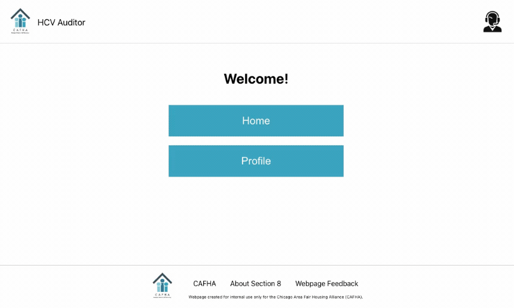
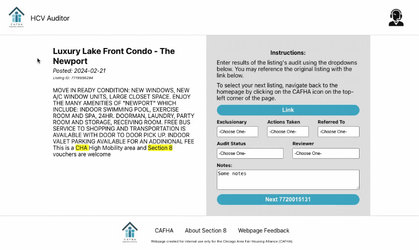

# HCV Auditor

## Description

This is a web application for the Chicago Area Fair Housing Alliance (CAFHA), a Chicago-based nonprofit, to assess data for fair housing compliance. The user can view high level data on the Home page, and dig into individual data on the Listing pages. From the Listing pages, they can also record decisions and actions taken.

The application was developed with React.js for the frontend and Node.js/Express.js for the backend. The database that the client reads/writes to is a PostgreSQL database.

The application is deployed on Google Cloud App Engine.

## Demos

### Home Page

### Listing Page

