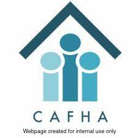

<div align="center">
  <h1 align="center">HCV Auditor</h1>
  <div>
    
    
  </div>
</div>

## About The Project

This is a web application for the Chicago Area Fair Housing Alliance (CAFHA), a Chicago-based nonprofit, to assess data for fair housing compliance. The user can view high level data on the Home page, and dig into individual data on the Listing pages. From the Listing pages, they can also record decisions and actions taken.

### Languages & Tools

* Frontend:
  * [HTML](https://developer.mozilla.org/en-US/docs/Web/HTML)
  * [CSS](https://developer.mozilla.org/en-US/docs/Web/CSS)
  * [JavaScript](https://developer.mozilla.org/en-US/docs/Web/JavaScript)
  * [React.js](https://react.dev/)
  * [Google Cloud App Engine](https://cloud.google.com/appengine/) (deployment)
* Backend:
  * [Node.js](https://nodejs.org/en)
  * [Express.js](https://expressjs.com/)
  * [Google Cloud App Engine](https://cloud.google.com/appengine/) (deployment)

The application reads and writes to a database developed with the [HCV Monitor](https://github.com/ikennedy240/hcv_monitor) project. The database is implemented with [PostgreSQL](https://www.postgresql.org/) and deployed with [Google Cloud SQL](https://cloud.google.com/sql/).

## Getting Started

*Instructions are not finalized as development and production modes are being refined

1. Clone the repo

   ```sh
   git clone https://github.com/wangbertha/hcv-auditor.git
   ```

2. Install NPM packages; the repo contains two separate projects, so you will need to `cd` into and install packages for each project.

   ```sh
   cd frontend
   npm install
   cd ../backend
   npm install
   ```

## Previews

The web application is an internal tool, and the deployment is not available publicly. Check out animations of the application below!

### Home Page


Features:

* View all listings that need to be audited
* Access the link to the original listing source
* Sort listings table by column

### Listing Page


Features:

* View key information on the selected listing
* Easily direct attention to keywords highlighted in the listing text
* Access the link to the original listing source
* Record their audit results and notes into the database
* Navigate to the next listing in the list

## Pending Improvements

* [ ] Transpile to TypeScript
* [ ] Refactor Listing page into efficient components
* [ ] Refactor dropdown menus into their own component
* [ ] Sync highlighted keywords in Listing page to [HCV Monitor](https://github.com/ikennedy240/hcv_monitor) project
